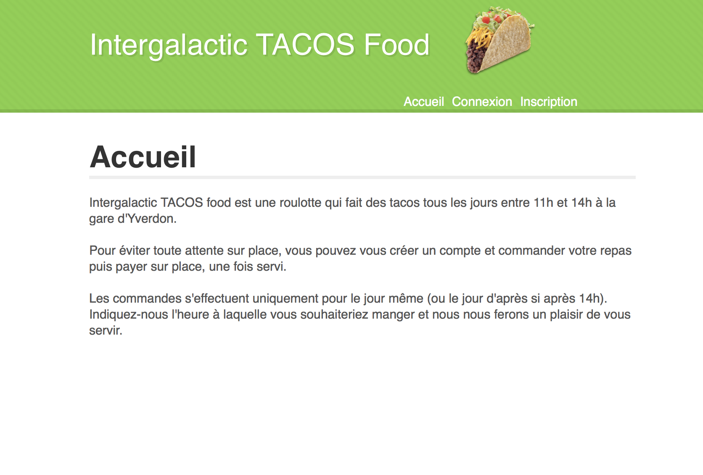
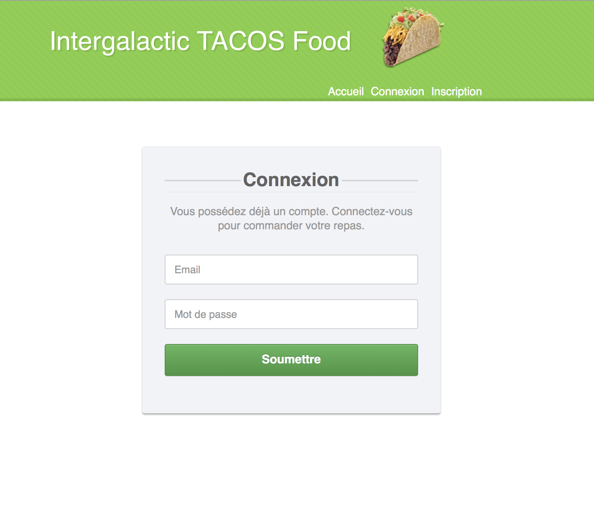
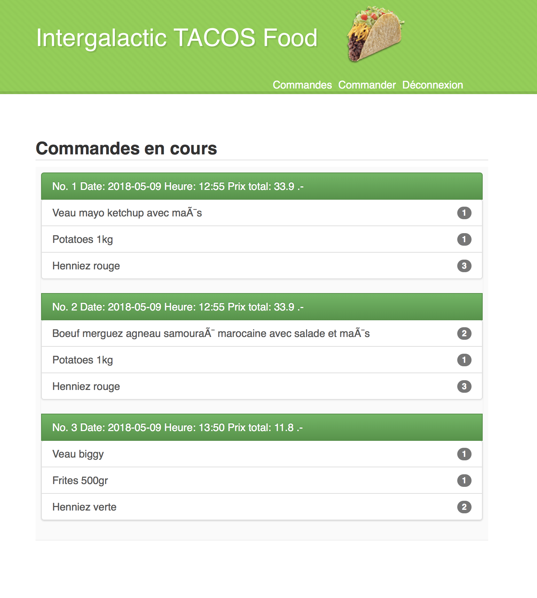
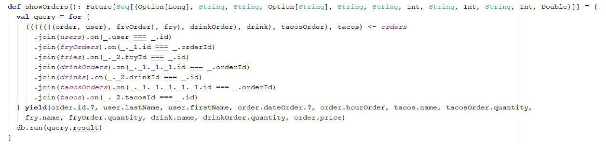

# Gestionnaire de Tacos :: A Scala Play project

Autheurs: Loan Lassalle, Julien Brêchet et Adrien Marco
***

## Description
Dans le cadre du cours de SCALA, le projet de gestionnaire de tacos consiste à créer une application web et sa base de données afin de mettre en pratique les connaissances acquises en cours.
L’application permet d’optimiser au mieux l’organisation de la préparation des menus pour les clients s’annonçant via une interface de réservation. Ce concept sert à diminuer l’attente sur place pendant la préparation de son repas.

Objectifs de l’application :
-  Gestion de comptes utilisateurs (clients) et d’un compte administrateur (restaurateur).

-  Page principale mettant en avant les différentes offres (tout le monde peut la consulter).
-  Un utilisateur peut se créer un compte utilisateur ou se connecter via un compte pour effectuer une commande (seulement si connecté). Une commande est composée de tacos, de boissons et de frites et elle peut se faire dans les 24h et pas avant. Les repas sont uniquement servis entre 11h et 14h et le paiement se fait sur place.
-  Un administrateur (compte créé en dur) peut afficher l’ensemble des commandes pour la journée et créer, mettre à jour et supprimer les tacos, les boissons et les frites. Une commande spécifie l’heure à laquelle elle doit être prête et son contenu ainsi que le client qui la commande. Les coordonnées de l’utilisateur peuvent éventuellement être utilisées pour avertir ce dernier en cas d’imprévu (numéro de téléphone, adresse mail).
-  Optionnel : ajout d’une interface de gestion pour l’administrateur (stock, nouveaux tacos, …).

## Interface
Les actions possibles sont séparées en plusieurs pages, chacune ayant sont rôle.

### Page d'accueil
Cette page sert à afficher une description de l'application et, comme toutes les autres pages, à fournir un menu de navigation pour effectuer les différentes requêtes:

### Page d'inscription
Cette page permet à l'utilisateur de s'inscrire pour pouvoir commander:

### Page de connexion
Cette page permet à l'utilisateur de se connecter:

### Page pour afficher les commandes en cours
Cette page permet à l'utilisateur de visualiser les commandes en cours:

### Page pour passer les commandes
Cette page permet à l'utilisateur de passer une commande:

### Page pour consulter les commandes
Cette page, destinée à l'administrateur, permet de consulter les commandes à préparer:

## Implémentation

Le projet est développé en scala avec la librairie Slick pour les requêtes à la base de données et le framework Play pour l'aspect web de l'application.

### Base de données
Voici le schéma de la base de données:

On représente une commande comme étant l'ensemble des tacos choisis en lien avec des frites, boissons et la personne qui fait la commande. Le prix et l'heure de service sont aussi pris en compte.

Les sauces, viandes et ingrédients qui constituent un tacos sont ici à titre informatif car l'application ne permet pas au client de personnaliser lui même la constitution d'un tacos. Il doit choisir parmis les compositions existantes correspondant aux noms des tacos de la liste.

### Routage
Voici les possibilités de navigation qui sont offertes par l'application:

Remarque: les autres pages non mentionnées sont inaccessibles et protégées grâce au framework Play. Bien entendu, il a fallu implémenter les notions de session et rôle utilisateur.

### Sessions et rôles utilisateurs

Voici par exemple, comment on peut rediriger les simples utilisateurs ou l'administrateur sur les pages adéquates après avoir vérifié que les credentials correspondent à un compte existant:

Remarque: c'est à ce moment que l'on crée une session pour un utilisateur authentifié.

### Les controllers

Différents "controllers" sont mis en place:

<ul>
<li>tacosHomeController: gère le point d'entrée dans l'application en renvoyant la vue de la page d'accueil.</li>
<li>tacosManagementController: sensé mettre à disposition une interface de gestion des produits pour le restaurateur mais cet aspect optionel n'a pas été implémenté.</li>
<li>Et encore une autre puce</li>
<li>tacosShowOrdersController: permet d'obtenir la liste des commandes du jour et de les afficher sur la vue correspondante.</li>
<li>tacosUserAdminConnectionController: gère les sessions et rôles des utilisateurs/admin.</li>
<li>tacosUserShowOrdersController: permet d'obtenir la liste des commandes en cours effectuées par le client et de les afficher sur la vue correspondante.</li>
<li>tacosUserOrderController: gère la création d'une commande.</li>
<li>tacosUserSignUpController: gère la création de nouveaux comptes utilisateurs.</li>
</ul>

### Les DAO
Après avoir créé un modèle qui représente les différents objets à manipuler, il faut pouvoir établir un lien entre ceux-ci et les valeurs que vont retourner les DAO lors des requêtes faites à la BD.
Si l'on prend par exemple le DAO des gérant les commandes (OrderDAO), on doit mapper les valeurs de la manière suivante:

Ensuite, il est possible de créer une requête pour la BD et d'en récupérer la réponse. Voici comment on peut par exemple (Slick) obtenir toutes les commandes effectuées en ne gardant que les éléments utiles pour le restaurateur (nom client, prix, produits sélectionnés, quantités, heure de service):

Remarque: il faut donc disposer d'un DAO pour chaque table du schéma relationnel pour représenter chaque entité.

## Conclusion
L'application est fonctionnelle, bien qu'il reste encore la page de management à implémenter (point optionnel selon le cahier des charges).

Il est à noter que toutes les fonctionnalités offertes par les DAO ne sont pas utilisées. Ces dernières sont à disposition dans la possibilité d'une éventuelle amélioration de l'application.
